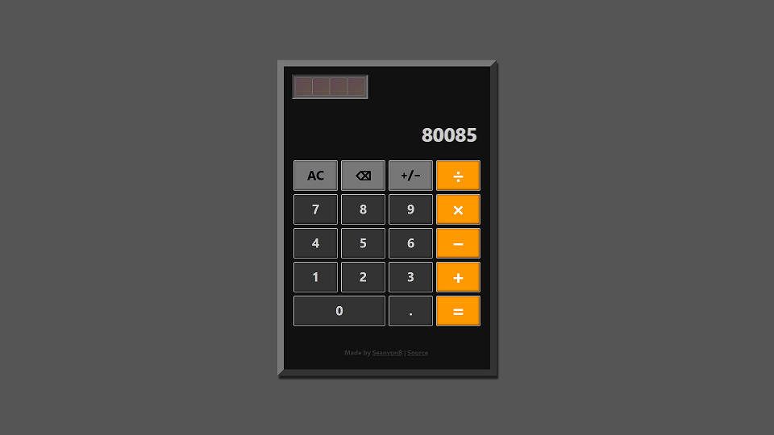

# Calculator

[LIVE PREVIEW](https://seanvonb.github.io/calculator/)

This web implementation of a standard pocket calculator helped reinforce my understanding of handling user input and maintaining a running device state. It displays and functions equally well on desktop and mobile.

## Features

-   Input numbers that are positive or negative, integer or decimal
-   Compose equations in sequence by continuing to input operations
-   Interact with the interface via cursor, touch, or keyboard

## Credits

-   This project was recommended by [The Odin Project](https://www.theodinproject.com/).

## License

Copyright © 2021 Sean von Bayern  
Licensed under the [MIT License](LICENSE.md)
